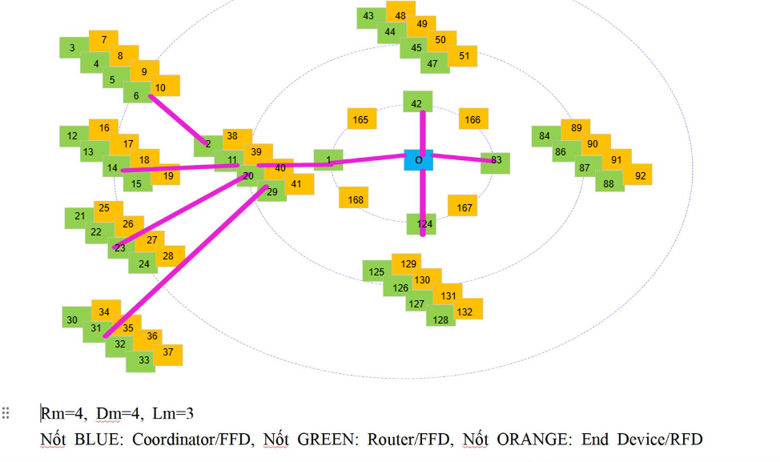
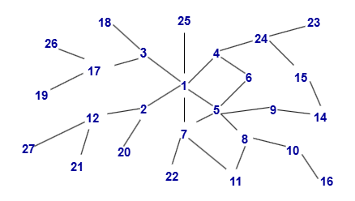

# Ôn tập NT532 - Công nghệ Internet of Things hiện đại

## ZigBee - 802.15.4

### Theory

> *Note: You can find more documents in Lecture 2*

- Maximum number of routers: $R_m$
- End devices that each router may have children: $D_m$
- Maximum deepth of tree: $L_m$
- Size of the address range: $A(d)$
	- $A(d) = 1 + D_m + R_m, \ \text{if} \ d = L_m - 1$ 
	- $A(d) = 1 + D_m + R_m \times A(d+1), \ \text{if} \ 0  \le d \lt L_m - 1$ 
- Router at depth $d$ 's address range: $R(x) = [x, x + A(d)]$ 
- i-th child router's $(1 \le i \le R_m)$ address range: 
	- $[x + (i-1) \times A(d+1) + 1, x + i + A(d+1)]$
- j-th child end-device's $(1 \le j \le D_m)$ address: 
	- $x + R_m \times A(d+1) + j$

### (Exercise): Assign address for all nodes, with  $R_m = 4, D_m = 4, L_m = 3$

- This topology has four depth levels: 0, 1, 2
- Size of address range for each depth level:
	- $A(2) = 1 + 4 + 4 = 9$
	- $A(1) = 1 + 4 + 4 \times A(1) = 41$
	- $A(0) = 1 + 4 + 4 \times A(0) = 169$
- Address range at coordinator: $R(0) = [0, 0 + A[0]] = [0, 169]$
	- 1st child router: $[0+(1-1) \times A(1)+1, 0+1 \times A(1)] = [1, 41]$ 
	- 2nd child router: $[0+(2-1) \times A(1)+1, 0+2 \times A(1)] = [42, 82]$  
	- 3th child router: $[0+(3-1) \times A(1)+1, 0+3 \times A(1)] = [83, 123]$  
	- 4th child router: $[0+(4-1) \times A(1)+1, 0+4 \times A(1)] = [124, 164]$
	- 1st child end-device: $0 + 4 \times A(1) + 1 = 165$ 
	- 2nd child end-device: $0 + 4 \times A(1) + 2 = 166$ 
	- 3th child end-device: $0 + 4 \times A(1) + 3 = 167$ 
	- 4th child end-device: $0 + 4 \times A(1) + 3 = 168$ 
- Address range at router: $R(1) = [1, 41]$
	- 1st child router: $[2, 10]$ 
	- 2nd child router: $[11, 19]$
	- 3th child router: $[20,28]$
	- 4th child router: $[29, 37]$
	- 1st child end-device: 38
	- 2nd child end-device: 39
	- 3th child end-device: 40
	- 4th child end-device: 41
- *Repeat the process until all devices have be assigned*

## Optimized Link State Routing protocol - OLSR

### Theory

> *Note: You can find more documents in Lecture 5*

- Multipoint relay set - MPR(N): a set of 1-hop neighbor nodes that can transmit control packet from node N to 2-hop neighbor nodes

	- Example at node 4 
	
- Multipoint relay selector set - MS(N): a set of SOURCE NODES (in 1-hop neighbor) selected N to forward THEIR broadcasted packets, to cover all 2-hop neighbor nodes

	- Example at node 3 
	
- Neighbor list - NBR(N): a list of nodes that are indicated as node N's neighbors by sending and receiving HELLO message from node N, used to optimize MPR(N) NBR set.

	- Example at node 4
	
- Topology Control message - TC(N): a list of advertised neighbors (link information) and sequence number (to prevent use of state information). Only MPR nodes generate and probagate TC message

	- Example at node 3

### (Exercise) Find: MRP(1), MPR(12), MPR(5), MPR(14), MS(2), MS(9), MS(5), MS(1) following by this topology

- MPR(1) = {2, 3, 4, 5, 7}
- MPR(12) = {2}
- MPR(5) = {1, 6, 7, 8, 9}
- MPR(14) = {9, 15}
- MS(2) = {1, 12, 20}
- MS(9) = {5, 14}
- MS(5) = {1, 6, 7, 8, 9}
- MS(1) = {2, 3, 4, 5, 7, 25}

### (Exercise) Given an IoT network including 6 nodes, draw the topology based on the nodes' routing tables and indicate the routing path from Node 6 to Node 1

 

- Answer

## Ad hoc On-demand Distance Vector routing protocol - AODV

### Theory

> *Note: You can find more documents in Lecture 5*

AODV Route request

- Initiated when a node wants to communicate with another node, but does not have a route to that node
- Source node broadcasts a route request (RREQ) packet to its neighbors
- RREQ packet structure

	 - 
 
	- Broadcast ID (broadcast_id): is incremented for every RREQ packet sen
	- Source/destination address (source_addr, dest_addr): uniquely identifies the RREQ
	- Source sequence number (source_sequence): indicates “freshness” of reverse route to the source
	- Destination sequence number (dest_squence) indicates freshness of route to the destination
	
- When a neighbor receives the RREQ, it will return a route reply (RREP) packet, or forward RREQ to its neighbors
- Receivers can identify and discard duplicate RREQ packets

AODV Route Reply

- If a node receives an RREQ packet and it has a current route to the target destination, then it unicasts a route reply packet (RREP) to the neighbor that sent the RREQ packet
- RREP packet structure

	- 

	- Source/destination address (source_addr, dest_addr): uniquely identifies the RREP
	- Destination sequence number (dest_squence) indicates freshness of route to the destination
	- (lifetime) or (hop_count): increase in the RREP packet when packet is routed
	
- Other RREP packets are discarded unless: (dest_sequence_#) number is higher than the previous, or (destination_sequence_#) is the same but (hop_cnt) is smaller

### (Example) RREQ and RREP from node 1 to node 7

- Node 1 needs to send a data packet to Node 7
- Assume Node 6 knows a current route to Node 7
- Assume that no other route information exists in the network (related to Node 7)

Routing steps

- **STEP 1**

	- Node 1 sends a RREQ packet to its neighbors

- **STEP 2** 

	- Nodes 2 and 4 verify that this is a new RREQ and that the source_sequence_# is not stale with respect to the reverse route to Node 1
	- Nodes 2 and 4 forward the RREQ
		- Update (source_sequence_#) for Node 1
		- Increment (hop_cnt) in the RREQ packet
		
- **STEP 3** 

	- RREQ reaches Node 6, which knows a route to 7
	- Node 6 must verify that the destination sequence number is less than or equal to the destination sequence number it has recorded for Node 7
	- Nodes 3 and 5 will forward the RREQ packet, but the receivers recognize the packets as duplicates

- **STEP 4** 

	- Node 6 knows a route to Node 7 and sends an RREP to Node 4 

- **STEP 5** 

	- Node 4 verifies that this is a new route reply (the case here) or one that has a lower hop count
	- If so, propagates the RREP packet to Node 1 and increases (hop_cnt) in the RREP packet

- **STEP 6** 

	- Node 1 now has a route to Node 7 in three hops and can use it immediately to send data packets
	- Note that the first data packet that prompted path discovery has been delayed until the first RREP was returned

## 6LoWPAN

> *Note: You can find documents in Lecture 3*

## WiFi - 802.11

*Note: You can refer to this lecture note [Lecture 17: 802.11 Wireless Networking](https://cseweb.ucsd.edu/classes/wi13/cse222A-a/lectures/222A-wi13-l17.pdf) - University of California San Diego*

## IoTs apps {coap/mqtt/...}, solutions, technologies

> *Note: You can refer to this lecture note [Lecture 5 - CoAP & MQTT](https://ocw.cs.pub.ro/courses/_media/iothings/sric/cursuri/iot-sric-2023-coap_mqtt.pdf) - Universitatea Politehnica din București* 

